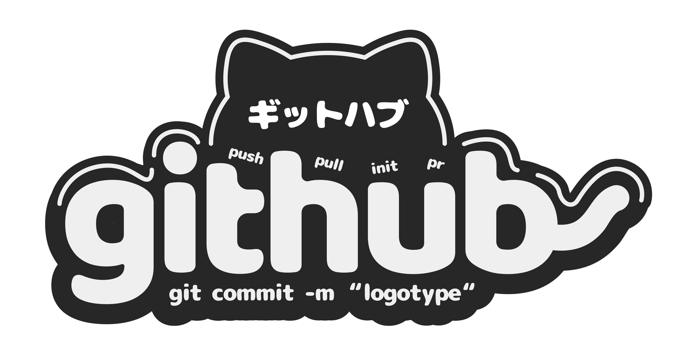

<div align="center">
  
</div>

<h1 align="center" style="font-weight: bold;">Super Portfolio 💻</h1>

<p align="center">
<a href="#tech">Technologies</a> |
<a href="#started">Getting Started</a> |
<a href="#colab">Collaborators</a> |
<a href="#contribute">Contribute</a>
</p>

<p align="center">⚡ Build your timeless portfolio with Super Portfolio with Nuxt 3 and Tailwind CSS </p>

<p align="center">
<a href="https://super-portfolioo.pages.dev/">📱 Visit this Project</a>
</p>

<h2 id="tech">💻 Technologies</h2>

- Nuxt 3
- Tailwind CSS v3
- Typescript
- Iconsax
- Nuxt Google Font

<h2 id="started">🚀 Getting started</h2>

### Prerequisites

- [Node JS](https://nodejs.org/)
- [Git](https://git-scm.com/)
- [PNPM](https://pnpm.io/installation)

### Cloning

```bash
git clone https://github.com/Rauliqbal/super-portfolio.git --branch main
```

### Starting the app

```bash
cd super-portfolio

# Install dependencies
pnpm install

# Run the Nuxt dev server
pnpm dev
```

Open the application at http://localhost:3000.

### Persistent content & admin space

- The portfolio content is stored in `server/storage/` via Nuxt Nitro’s file-based storage. These files are ignored by Git so every environment keeps its own data.
- Default blocks are seeded from `utils/content.ts` during server start. Deleting a JSON file under `server/storage/content` will recreate it with the default values.
- Visit `/admin` to access the administration area. Use the default credentials `admin@example.com` / `ChangeMe123!` or override them with the `ADMIN_EMAIL` and `ADMIN_PASSWORD` environment variables.
- Forms validate data with Zod on the client and server before persisting updates. API endpoints live under `/api/content/*` and `/api/auth/*` (mutations require the session cookie plus the `X-CSRF-Token` header handled automatically in the admin UI).

#### Environment variables

Set these variables if you need to customise the defaults:

```
SESSION_COOKIE_NAME=bro_world_session
CSRF_COOKIE_NAME=bro_world_csrf
SESSION_MAX_AGE=86400
ADMIN_EMAIL=admin@example.com
ADMIN_PASSWORD=ChangeMe123!
```

All variables have fallbacks, so the app runs without additional configuration.

<h2 id="colab">🤝 Collaborators</h2>

<p>Special thank you for all people that contributed for this project.</p>
<table>
<tr>

<td align="center">
<a href="https://github.com/Rauliqbal">
<br>
<sub>
<b>Rauliqbal</b>
</sub>
</a>
</td>
<td align="center">
<a href="https://github.com/kkkfasya">
<br>
<sub>
<b>kkkfasya</b>
</sub>
</a>
</td>

</tr>
</table>

<h2 id="contribute">📫 Contribute</h2>

Here you will explain how other developers can contribute to your project. For example, explaining how can create their branches, which patterns to follow and how to open an pull request

1. `git clone https://github.com/Rauliqbal/super-portfolio.git`
2. `git checkout -b feature/NAME`
3. Follow commit patterns
4. Open a Pull Request explaining the problem solved or feature made, if exists, append screenshot of visual modifications and wait for the review!

<h3>Documentations that might help</h3>

[📝 How to create a Pull Request](https://www.atlassian.com/br/git/tutorials/making-a-pull-request)

[💾 Commit pattern](https://gist.github.com/joshbuchea/6f47e86d2510bce28f8e7f42ae84c716)

<div align="center">
  
</div>
